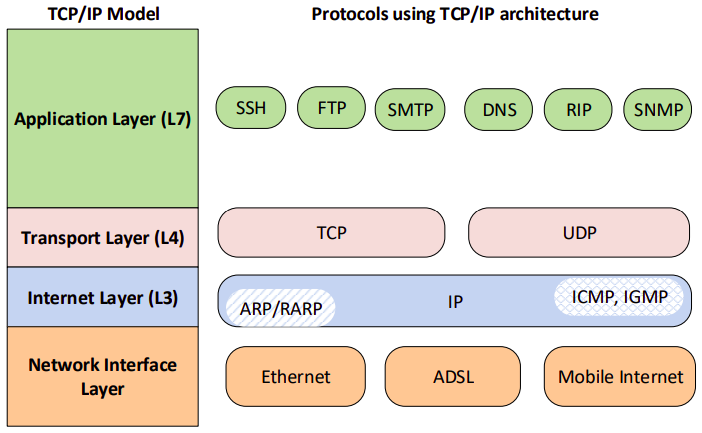
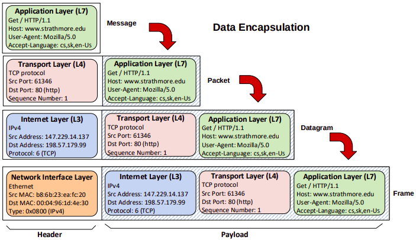
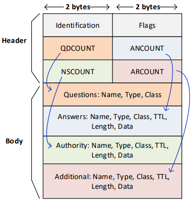
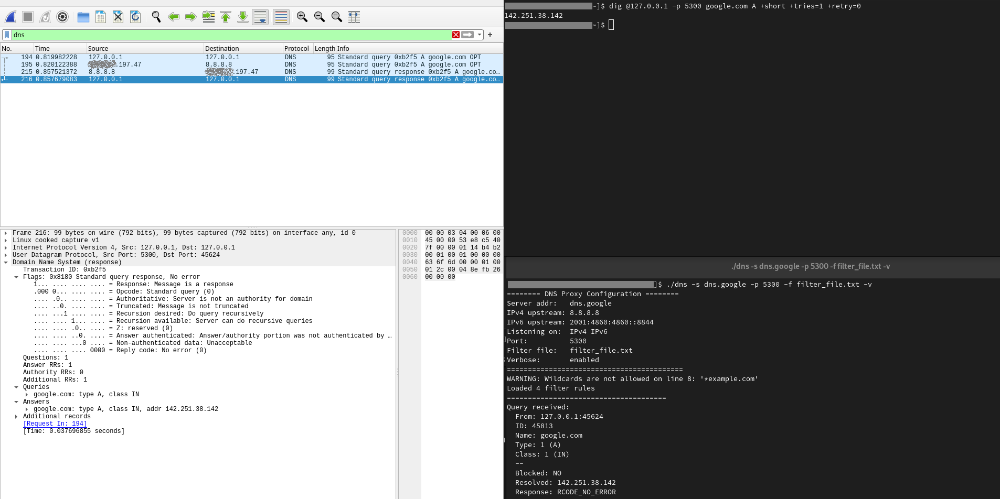
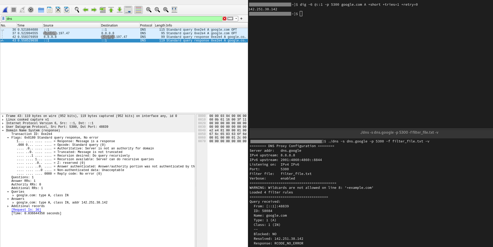
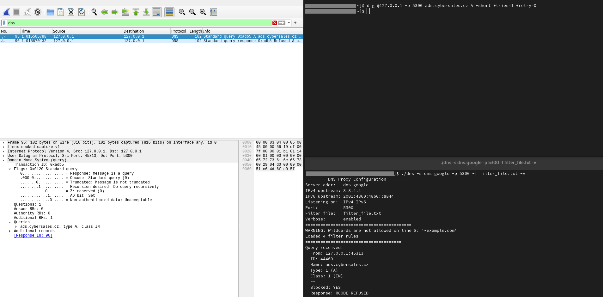

# ISA DNS filtering resolver


Author: Adam Havlik - xhavli59

Date: 17.11.2025

## About

A lightweight DNS proxy server implemented in C++ that filters A-record over UDP queries based on a blacklist. It forwards allowed requests to an upstream resolver and blocks unwanted domains with custom DNS replies.

Program support only A in IN records which can filter and refuse or relay to real DNS server and return result back to a client with No Error. Others are marked as Not Implemented and returned back to a client.

Task assignment available on [link](https://www.vut.cz/studis/student.phtml?script_name=zadani_detail&apid=294160&zid=61294)

Solution available on GitHub [repository](https://github.com/xhavli/ISA25_DnsProxy)

## Summary

- [Problem Introduction](#problem-introduction)
- [Program Dependencies](#program-dependencies)
- [Program Execution](#program-execution)
  - [Makefile](#makefile)
  - [Run Commands](#run-commands)
    - [CLI arguments](#cli-arguments)
  - [Filter File](#filter-file)
- [Application Output](#application-output)
- [Implementation Details](#implementation-details)
  - [Architecture](#architecture)
  - [Program Flow](#program-flow)
  - [Return Codes](#return-codes)
- [Tests](#tests)
  - [Manual Tests](#manual-tests)
  - [Automatic Tests](#automatic-tests)
- [Known Problems](#known-problems)
- [Bibliography](#bibliography)
- [Notes](#notes)

## Problem Introduction

This is a short introduction to pure DNS concepts and flow, not DNSSEC - secured version of DNS, DoH etc.

### TCP/IP Stack

Heres is a pictures displaying whats happening in TCP/IP model, its layers and some important protocols for this task on each layer or sample build packet.

  
Picture taken from [ISA 2025 BASICS](#bibliography)

  
Picture taken from [ISA 2025 BASICS](#bibliography)

## DNS

The Domain Name System (DNS) is a hierarchical and distributed naming system that translates human-friendly domain names (like example.com) into IP addresses that computers use to identify each other on the network. Its primary purpose is to make accessing websites and online services easier for users by using readable names instead of complex numerical IP addresses. DNS operates in a client-server architecture, where a DNS client (often part of your operating system) sends a query to a DNS server to resolve a domain name. This request may be answered directly by the server if it has the information cached, or it may query other DNS servers recursively until the IP address is found. Once resolved, the IP address is returned to the client, enabling communication with the desired website or service.

Format of DNS communication is based on binary protocol described in [RFC1035](#bibliography).

- Transport Protocols on L4 layers

    According to _Assessing Support for DNS-over-TCP in the
    Wild_ [research paper](https://www.akamai.com/site/en/documents/research-paper/assessing-support-for-dns-over-tcp-in-the-wild.pdf) and many more articles common communication goes over UDP (more than 99%). Reason is simple, its much more faster than initiating a connection in case of TCP but theres a risk of packet loss based on nature of the UDP.

- Internet Protocols on L3 layers

    DNS protocol naturally support IPv4 and IPv6 internet protocols both on port 53. According to statistics from [Google](https://www.google.com/intl/en/ipv6/statistics.html#tab=ipv6-adoption) public DNS servers, majority communication incoming from IPv4 address and minority is on IPv6 (less than 50%). But we can observe a sharply rising trend from 2013 when it was around 2%.

  
Picture taken from [ISA 2025 DNS](#bibliography)

## Program Dependencies

- Language C++ std 17
- Compiler g++
- License AGPL-3.0
- Developed for linux

## Program Execution

As application is listening by default every outgoing traffic from interface on port 53, which is standard port for system DNS service it may requires a `sudo` permissions to run it in this configuration.

### Makefile

Makefile commands:

- `make` will compile program to a `dns` executable file
- `make clean` will remove `dns` executable file
- `make test` will run tests

### Run Commands

Provide every possible arguments:

- Use upstream DNS server by `dns.google`, listen on port `5300`, load the blocked domains from `filter_file.txt` and enable verbose output.

    ``` bash
    ./dns -s dns.google -p 5300 -f filter_file.txt -v
    ```

#### CLI arguments

| Name           | Argument | Need       | Default values | Possible values | Meaning or expected program behavior
| -------------- | -------- | ---------- | -------------- | --------------- | ----------------------------------------------------
| Server         | `-s`     | required   |                | `string`        | Specify domain of ip address of upstream DNS server
| Listen on port | `-p`     | optional   | `53`           | `uint_16`       | Set listening port of outgoing DNS queries
| Filter file    | `-f`     | required   |                | `string`        | Specify file with blocked domains and its subdomains
| Verbose        | `-v`     | optional   | false          |                 | Enable verbose output if provided

- In case some of optional argument `-p` will not be provided, "WARNING" will be shown and default values will be set

### Filter file

This chapter takes part about filter file syntax. Filter file is list of blocked domains or subdomains concatenated per line. Syntax allow line comments starts with `#` which mean ignore everything in this line after `#`. Logic also ignore whitespaces and protocol names (www/http). Wildcard is not allowed. every domain should be standard domain described in [RFC1035](#bibliography) and [RFC1123](https://datatracker.ietf.org/doc/html/rfc1123). Example file is available on this [link](https://pgl.yoyo.org/adservers/serverlist.php?hostformat=nohtml&showintro=1).

## Application Output

Application naturally does not print any unimportant outputs except warnings caused on setup to inform user about maybe unexpected configuration.

In verbose mode application print some details about incoming DNS queries to `STDOUT`, warnings and errors to `STDERR`.

Output examples:

- Configuration information:

    ```plaintext
    ======== DNS Proxy Configuration ========
    Server addr:   dns.google
    IPv4 upstream: 8.8.8.8
    IPv6 upstream: 2001:4860:4860::8888
    Listening on:  IPv4 IPv6
    Port:          5300
    Filter file:   filter_file.txt
    Verbose:       enabled
    ==========================================
    WARNING: Wildcards are not allowed on line 6: '*example.com'
    Loaded 3 filter rules
    ==========================================
    ```

- Received query with allowed domain over IPv4:

    ```plaintext
    Query received:
        From: 127.0.0.1:60541
        ID: 64316
        Name: google.com
        Type: 1 (A)
        Class: 1 (IN)
        --
        Blocked: NO
        Resolved: 142.251.36.110
        Response: RCODE_NO_ERROR
    ```

- Received query with allowed domain over IPv6:

    ```plaintext
    Query received:
        From: [::1]:45422
        ID: 20976
        Name: google.com
        Type: 1 (A)
        Class: 1 (IN)
        --
        Blocked: NO
        Resolved: 142.251.36.110
        Response: RCODE_NO_ERROR
    ```

- Received query with blocked domain over IPv4:

    ```plaintext
    Query received:
        From: 127.0.0.1:40969
        ID: 10758
        Name: ads.cybersales.cz
        Type: 1 (A)
        Class: 1 (IN)
        --
        Blocked: YES
        Response: RCODE_REFUSED
    ```

## Implementation Details

## Tests

### Manual Tests

- DNS query with allowed domain over IPv4:

    ```bash
    - dig @127.0.0.1 -p 5300 google.com A +short +tries=1 +retry=0
    ```

    

- DNS query with allowed domain over IPv6:

    ```bash
    - dig @[::1] -p 5300 google.com A +short +tries=1 +retry=0
    ```

    

- DNS query with blocked domain over IPv4:

    ```bash
    - dig @[::1] -p 5300 ads.cybersales.cz A +short +tries=1 +retry=0
    ```

    

### Automatic Tests

## Known Problems

- Using of global variables in this project
- Used blocking sockets
- Refresh rate - active waiting for `Ctrl+C` interrupt set to 250 milliseconds
- This is caused because author think portable code mean portable across Linux distributions, MacOS and Windows. New knowledge is that mean portable between BSD based operating systems which are usually some of linux distributions

## Bibliography

[ISA 2025 BASICS] Matoušek, P. _Architektura sítí, adresování, testování_. September 2025. [cited 17.11.2025]. Available at: <https://moodle.vut.cz/pluginfile.php/1174611/mod_resource/content/7/isa-architektura.pdf>

[ISA 2025 DNS] Matoušek, P. _Systém DNS_. September 2025. [cited 17.11.2025]. Available at: <https://moodle.vut.cz/pluginfile.php/1174654/mod_resource/content/10/isa-dns.pdf>

[RFC1035] _Domain Names - Implementation and Specification_ available at: <https://datatracker.ietf.org/doc/html/rfc1035>

[RFC791] _Internet Protocol_ available at: <https://datatracker.ietf.org/doc/html/rfc791>

[RFC2460] _Internet Protocol, Version 6 (IPv6) Specification_ available at: <https://datatracker.ietf.org/doc/html/rfc2460>

[RFC768] _User Datagram Protocol (UDP)_ available at: <https://datatracker.ietf.org/doc/html/rfc768>

## Notes

- Program was developed with support of ChatGPT and GithubCopilot for better understanding a C++ syntax, not for direct solving core of the project
